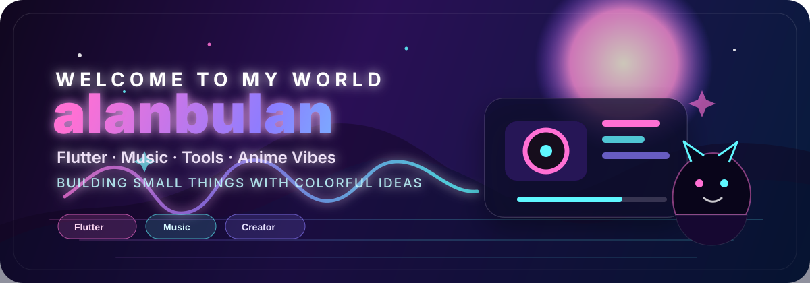

<div align="center">
  
  <br />
  <br />
  
  <br />
  <br />
  
</div>

<br />

<div align="center">

# alanbulan

Flutter developer and indie tool builder.

Music apps, mobile experiences, practical tools, and dark anime-inspired interfaces.

</div>

---

## About

```txt
name      alanbulan
focus     Flutter, music apps, mobile experience, useful tools
style     Japanese anime mood, neon motion, clean dark UI
status    building and shipping
```

I like turning small ideas into usable products. Most of my work is around cross-platform apps, music playback experiences, and tools that remove repetitive work.

## Stack

```txt
Flutter        cross-platform apps
Dart           app logic and UI
React          web interfaces
TypeScript     frontend tooling
Node.js        small services and scripts
Python         automation and experiments
GitHub         shipping and collaboration
```

## Direction

| Area | Direction |
| --- | --- |
| Product | small apps that are actually useful |
| Interface | clean, fast, animated, and atmospheric |
| Music | player experience, search, playback, library flow |
| Tools | scripts and utilities that save time |
| Style | Japanese night city, neon color, anime detail |

## Featured

| Project | Description |
| --- | --- |
| [TuneFree Mobile](https://github.com/alanbulan/TuneFree_Mobile) | Flutter music player project focused on mobile listening experience |

---

<div align="center">
  <sub>Build useful things. Keep the interface sharp. Let the motion glow.</sub>
</div>
